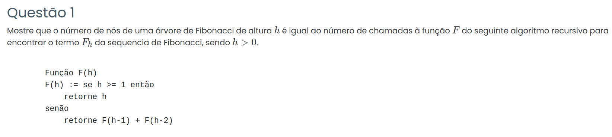

### Resposta:

Eu encontrei um pequeno erro no pseudocódigo e corrigi a função para:

```bash
Função F(h)
    se h <= 1 então
        retorne h
    senão
        retorne F(h-1) + F(h-2)
````

Essa função é recursiva e, ao ser executada, gera uma árvore de Fibonacci, onde cada chamada da função corresponde a um nó da árvore.

Seja:

* ( N(h) ) o número de nós da árvore de Fibonacci de altura (h)
* ( C(h) ) o número de chamadas da função (F(h))

Vamos provar, por indução matemática, que:

$$
N(h) = C(h)
$$


#### Casos base

Para (h = 0), a função executa apenas (F(0)):

$$
N(0) = 1
$$

$$
C(0) = 1
$$

Para (h = 1):

$$
N(1) = 1
$$

$$
C(1) = 1
$$

Logo,

$$
N(0) = C(0) \quad \text{e} \quad N(1) = C(1)
$$


#### Passo de indução

Ao calcular (F(h)), ocorre:

* 1 chamada da função atual
* chamadas de (F(h-1))
* chamadas de (F(h-2))

Portanto, o número de chamadas é:

$$
C(h) = 1 + C(h-1) + C(h-2)
$$

Na árvore de Fibonacci ocorre o mesmo:

* 1 nó raiz
* subárvore de altura (h-1)
* subárvore de altura (h-2)

Logo, o número de nós é:

$$
N(h) = 1 + N(h-1) + N(h-2)
$$


#### Hipótese de indução

Suponha que seja verdadeiro para um valor (k):

$$
N(k) = C(k)
$$

e

$$
N(k-1) = C(k-1)
$$


### Provar para (k+1)

Partindo da definição de nós:

$$
N(k+1) = 1 + N(k) + N(k-1)
$$

Substituindo a hipótese de indução:

$$
N(k+1) = 1 + C(k) + C(k-1)
$$

Pela definição de chamadas:

$$
C(k+1) = 1 + C(k) + C(k-1)
$$

Portanto,

$$
N(k+1) = C(k+1)
$$


#### Conclusão

Como os casos base são verdadeiros e o passo de indução foi demonstrado, conclui-se que:

$$
N(h) = C(h)
$$

para todo (h > 0), ou seja, o número de nós da árvore de Fibonacci de altura (h) é igual ao número de chamadas da função (F(h)).
