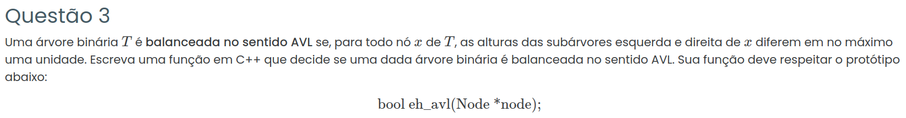

### Resposta:

```c++
#include <iostream>
#include <algorithm>
using namespace std;

struct Node {
    int value;
    Node *left;
    Node *right;
};

// Função auxiliar que retorna a altura
// Se não for AVL, retorna -1
int altura(Node *node) {
    if (node == NULL)
        return 0;

    int h_esq = altura(node->left);
    if (h_esq == -1) return -1;

    int h_dir = altura(node->right);
    if (h_dir == -1) return -1;

    if (abs(h_esq - h_dir) > 1)
        return -1;

    return 1 + max(h_esq, h_dir);
}

bool eh_avl(Node *node) {
    return altura(node) != -1;
}
```