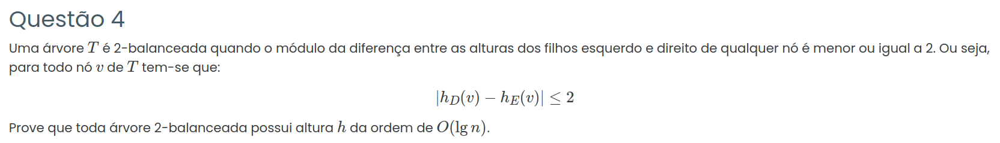

### Resposta:

Para provar que a altura é \(O(\log n)\), vou mostrar que o número mínimo de nós de uma árvore 2-balanceada de altura \(h\) cresce exponencialmente.

Se o número de nós cresce exponencialmente, então a altura cresce logaritmicamente em função de \(n\).

#### Número mínimo de nós

Seja \(N(h)\) o número mínimo de nós de uma árvore 2-balanceada de altura \(h\).

Para obter o menor número de nós possível, a árvore deve estar o mais desbalanceada possível, mas ainda respeitando:

$$
|h_D(v) - h_E(v)| \leq 2
$$

Assim, a pior situação ocorre quando:

- uma subárvore tem altura \(h-1\)
- a outra tem altura \(h-3\)

Logo, o número mínimo de nós satisfaz a recorrência:

$$
N(h) = 1 + N(h-1) + N(h-3)
$$

onde:

- 1 é o nó raiz
- \(N(h-1)\) é a subárvore maior
- \(N(h-3)\) é a subárvore menor

#### Casos base

Para pequenas alturas temos:

$$
N(0) = 1
$$

$$
N(1) = 2
$$

$$
N(2) = 3
$$

#### Crescimento da função

A recorrência é:

$$
N(h) = 1 + N(h-1) + N(h-3)
$$

Podemos escrever:

$$
N(h) \geq N(h-1) + N(h-3)
$$

Essa recorrência cresce de forma exponencial, semelhante à sequência de Fibonacci.

Assim, existe uma constante \(c > 1\) tal que:

$$
N(h) \geq c^h
$$

#### Relação entre altura e número de nós

Sabemos que o número total de nós da árvore é \(n\), então:

$$
n \geq N(h)
$$

Logo:

$$
n \geq c^h
$$

Aplicando logaritmo nos dois lados:

$$
\log n \geq h \log c
$$

Isolando \(h\):

$$
h \leq \frac{\log n}{\log c}
$$

Como \(\log c\) é constante, então:

$$
h = O(\log n)
$$

Logo, o número mínimo de nós de uma árvore 2-balanceada cresce exponencialmente com a altura.

Assim, a altura cresce de forma logarítmica em relação ao número de nós.

Portanto,

$$
h = O(\log n)
$$

Logo, **toda árvore 2-balanceada possui altura da ordem de \(O(\log n)\)**.