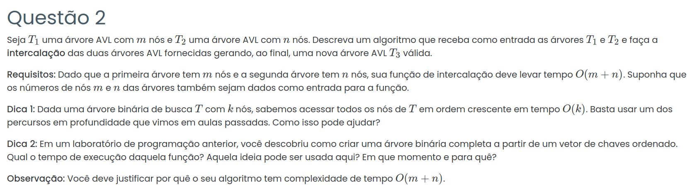

### Resposta:

#### 1. Passo a passo do algoritmo

1. **Percorrer em‑ordem \(T_1\) e \(T_2\)**  
   - Uso o percurso em‑ordem em profundidade para visitar todos os nós de \(T_1\) e armazenar suas chaves em um vetor \(V_1\) ordenado.  
   - Repito o mesmo para \(T_2\), gerando um vetor \(V_2\) também ordenado.  
   - Como o percurso em‑ordem visita cada nó exatamente uma vez, essa etapa leva tempo \(O(m+n)\).  

2. **Mesclar os vetores ordenados \(V_1\) e \(V_2\)**  
   - Uso o algoritmo de merge (igual ao do mergesort) para combinar \(V_1\) e \(V_2\) em um único vetor \(V_3\) ordenado.  
   - O merge usa dois apontadores, copiando sempre o menor elemento disponível para \(V_3\), até esgotar um dos vetores e copiar o restante do outro.  
   - Como cada vetor tem tamanho \(m\) e \(n\), o merge leva tempo \(O(m+n)\).  

3. **Construir uma árvore AVL a partir de \(V_3\)**  
   - Aplico o método que vimos em laboratório de construção de árvore quase completa a partir de um vetor ordenado:  
     - Escolho o elemento do meio do intervalo como raiz.  
     - Repito recursivamente à esquerda e à direita com as metades do vetor.  
   - Isso garante que a diferença de altura entre as subárvores de qualquer nó é no máximo 1, ou seja, a condição AVL é satisfeita em todos os nós.  
   - Como cada elemento de \(V_3\) é usado exatamente uma vez na construção, o tempo dessa etapa é \(O(m+n)\).  


#### 2. Pseudocódigo do algoritmo

```text
função intercalarAVL(T1, m, T2, n):
    V1 = perCursoInordem(T1)            // O(m)
    V2 = perCursoInordem(T2)            // O(n)
    V3 = merge(V1, V2)                  // O(m+n)
    T3 = constroiAVL(V3, 0, m+n-1)      // O(m+n)
    retorna T3

função perCursoInordem(T):
    lista = []
    se T ≠ nil:
        lista.append(perCursoInordem(T.esq))
        lista.append(T.chave)
        lista.append(perCursoInordem(T.dir))
    retorna lista

função merge(V1, V2):
    i = 0; j = 0; V3 = []
    enquanto i < m e j < n:
        se V1[i] <= V2[j]:
            V3.append(V1[i])
            i++
        senão:
            V3.append(V2[j])
            j++
    enquanto i < m:
        V3.append(V1[i]); i++
    enquanto j < n:
        V3.append(V2[j]); j++
    retorna V3

função constroiAVL(V, esq, dir):
    se esq > dir:
        retorna nil
    meio = (esq + dir) // 2
    T = novo_no(V[meio])
    T.esq = constroiAVL(V, esq, meio-1)
    T.dir = constroiAVL(V, meio+1, dir)
    retorna T
```


#### 3. Por que a árvore resultante é AVL?

Uma árvore é AVL quando, para todo nó \(v\), o **fator de balanceamento** \(FB(v)\), definido como  
\[
FB(v) = \text{altura}(v.\text{esq}) - \text{altura}(v.\text{dir}),
\]  
satisfaz \(FB(v) \in \{-1, 0, 1\}\).  

Na função `constroiAVL(V, esq, dir)`, o elemento do meio é sempre escolhido como raiz, e as subárvores são construídas sobre intervalos de tamanho aproximadamente iguais. Dessa forma, a altura das subárvores difere no máximo em 1, o que garante que a condição de AVL é mantida em todos os nós da árvore \(T_3\).


### 4. Resposta às dicas

**Dica 1:**  
Dada uma árvore binária de busca \(T\) com \(k\) nós, sabemos acessar todos os nós em ordem crescente em tempo \(O(k)\) usando o percurso em‑ordem em profundidade. Isso me ajuda porque, ao aplicar o percurso em‑ordem em \(T_1\) e \(T_2\), obtenho vetores ordenados \(V_1\) e \(V_2\) contendo todas as chaves das duas árvores. Assim, a intercalação se reduz a combinar dois vetores ordenados, que é um problema clássico resolvido em tempo linear, compatível com o requisito \(O(m+n)\).  

**Dica 2:**  
No laboratório anterior, aprendi a criar uma árvore binária completa a partir de um vetor de chaves ordenado, escolhendo o elemento do meio como raiz e repetindo recursivamente para as metades à esquerda e à direita. O tempo de execução dessa função é \(O(k)\), pois cada chave é usada exatamente uma vez na construção. Essa ideia pode ser usada aqui logo após o merge dos vetores \(V_1\) e \(V_2\): a partir do vetor \(V_3\) ordenado resultante, aplico essa função para construir a árvore AVL final \(T_3\), garantindo que ela seja balanceada e válida, ainda em tempo \(O(m+n)\).  


### 5. Justificativa da complexidade \(O(m+n)\)

- Percorrer em‑ordem \(T_1\) e \(T_2\): cada percurso visita todos os nós exatamente uma vez, logo \(O(m)\) e \(O(n)\), somando \(O(m+n)\).  
- Mesclar \(V_1\) e \(V_2\): o merge de dois vetores ordenados de tamanho \(m\) e \(n\) leva tempo \(O(m+n)\).  
- Construir a árvore a partir de \(V_3\): cada chave do vetor de tamanho \(m+n\) é usada exatamente uma vez na construção recursiva, resultando em tempo \(O(m+n)\).  

Como todas as etapas são executadas em tempo linear em relação ao total de nós das duas árvores, o algoritmo inteiro tem complexidade de tempo \(O(m+n)\), satisfazendo os requisitos da questão.