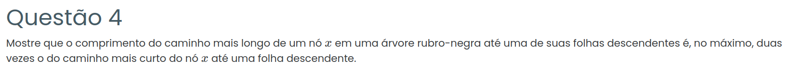

### Resposta:

Seja \(b\) o número de nós pretos em qualquer caminho simples de \(x\) até uma folha descendente (propriedade P5).

### Caminho Mais Curto
O caminho de comprimento mínimo contém apenas nós pretos:

\[
\text{Caminho: } x(P) \to P_1(P) \to P_2(P) \to \dots \to P_{b-1}(P) \to \text{NIL}(P)
\]

Número de nós: \(b\)  
Número de arestas: \(s = b - 1\)

**Desigualdade:** \(s \geq b - 1\)

### Caminho Mais Longo
O caminho de comprimento máximo alterna cores, respeitando P4 (sem dois nós vermelhos consecutivos):

\[
\text{Caminho: } x(P) \to R_1(V) \to P_1(P) \to R_2(V) \to \dots \to P_{b-2}(P) \to \text{NIL}(P)
\]

- \(b\) nós pretos (fixo por P5)
- Máximo \(b-1\) nós vermelhos (entre \(b\) pretos, termina em preto)

Total de nós: \(b + (b-1) = 2b - 1\)  
Número de arestas: \(l \leq (2b - 1) - 1 = 2b - 2\)

### Prova da Desigualdade Final

**Passo 1:** Da análise do caminho curto:  
\[
s \geq b - 1
\]

**Passo 2:** Somando 1 em ambos os lados:  
\[
s + 1 \geq b \quad \implies \quad b \leq s + 1
\]

**Passo 3:** Multiplicando por 2 (preserva desigualdade):  
\[
2b \leq 2(s + 1)
\]

**Passo 4:** Subtraindo 2:  
\[
2b - 2 \leq 2(s + 1) - 2
\]

**Passo 5:** Simplificando o lado direito:  
\[
2(s + 1) - 2 = 2s + 2 - 2 = 2s
\]

**Passo 6:** Combinando com o limite do caminho longo:  
\[
l \leq 2b - 2 \leq 2s
\]

**Conclusão:** \(l \leq 2s\)