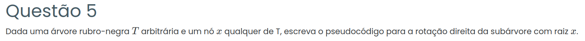

### Resposta:

## Pseudocódigo

```
ROTACAO-DIREITA(T, x)
    y ← x.esquerda
    x.esquerda ← y.direita
    se y.direita ≠ NIL então
        y.direita.pai ← x
    y.pai ← x.pai
    se x.pai = NIL então
        T.raiz ← y
    senão se x = x.pai.direita então
        x.pai.direita ← y
    senão
        x.pai.esquerda ← y
    y.direita ← x
    x.pai ← y
```