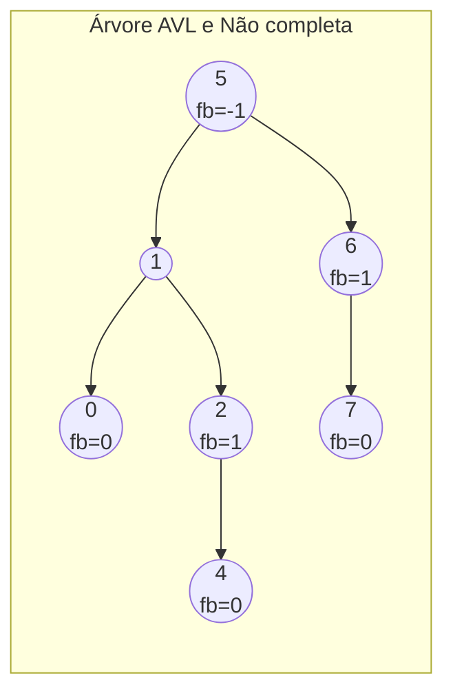
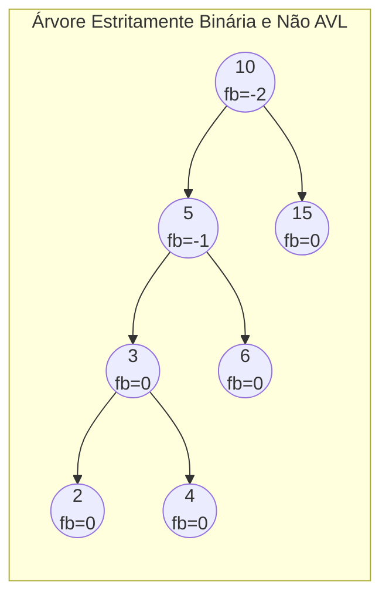

**Questão 04)**

**Item a)** Toda árvore cheia é completa.

Verdade.
Pela definição, uma *árvore cheia* é aquela em que, se *v* é um nó com alguma de suas subárvores vazia, então *v* se localiza no último nível, enquanto uma *árvore completa* é aquela em que, se *v* é um nó tal que alguma subárvores de *v* é vazia, então *v* se localiza ou no último ou no penúltimo nível dá árvore. Logo, se tivermos uma árvore *T* cheia, e se ela possui um nó *v* faltando alguma de suas subárvores, *v* se localiza último nível, o que contempla também a definição de *árvore completa* que *v* estaria ou no penúltimo ou no último nível da árvore.

**Item b)** Toda árvore AVL é completa.

Falso.
Exemplo:

Pela definição de AVL, essa árvore aprensenta a diferença de altura entre as subárvores esquerda e direito dentro do intervalo de [-1, 0, 1]. Porém, essa árvore não entra na definição de *Árvore Completa*, pois o nós 6 não tem o filho esquerdo e não se localiza no último ou no penúltimo nível, como pedido pela definição.

**Item c)** Toda árvore estritamente binária é AVL

Falso.
Exemplo:

Como podemos observar, a árvore é estritamente binária, o que quer que os seus nós tem 0 ou 2 filhos, mas ela não é AVL, pois a raiz apresentar um fator de balanceamento de -2, indicando que a árvore está desbalanceada a esquerda