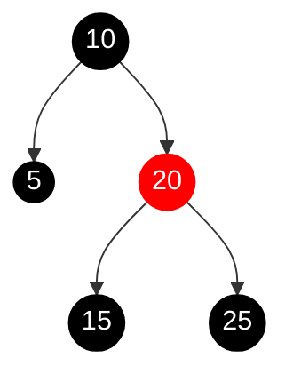

**Questão 03)**

```mermaid
graph TD
    A((10)) --> B((5))
    A((10)) --> C((20))
    C((20)) --> D((15))
    C((20)) --> E((25))

    %% Estilização para representar as cores
    style A fill:#000,color:#fff,stroke:#000
    style B fill:#000,color:#fff,stroke:#000
    style C fill:#f00,color:#fff,stroke:#f00
    style D fill:#000,color:#fff,stroke:#000
    style E fill:#000,color:#fff,stroke:#000
```