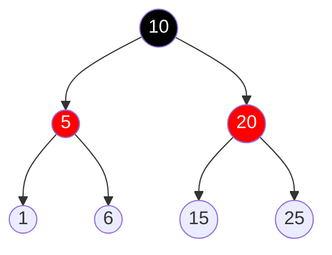
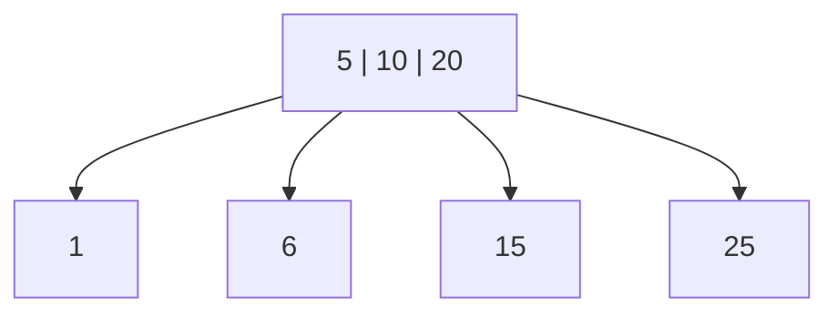

**18.1-5** - Describe the data structure that results if each black node in a red-black tree absorbs its red children, incorporating their children with its own.

**Resposta:**

Se cada nó preto absorver seus filhos vermelhos, a estrutura resultante será uma Árvore B (especificamente uma Árvore 2-3-4, onde o grau mínimo $t=2$).

Isso acontece porque, em uma árvore rubro-negra, um nó preto pode ter 0, 1 ou 2 filhos vermelhos. Ao realizar a absorção, o "super-nó" resultante terá as seguintes configurações de chaves e filhos:

* 0 filhos vermelhos: O nó preto permanece com 1 chave e 2 ponteiros de filhos (um nó 2 da Árvore B).
* 1 filho vermelho: O nó preto incorpora a chave do filho, ficando com 2 chaves e 3 ponteiros de filhos (um nó 3 da Árvore B).
* 2 filhos vermelhos: O nó preto incorpora ambas as chaves, ficando com 3 chaves e 4 ponteiros de filhos (um nó 4 da Árvore B).

Dessa forma, garantimos que cada nó tenha entre $t-1=1$ e $2t-1=3$ chaves, respeitando a definição de Árvore B para $t=2$.

Além disso, a ordenação dos ponteiros de filhos ($C$) em relação às chaves incorporadas ($x_i$) mantém a propriedade de árvore de busca:
$$C_1 < x_1 < C_2 < x_2 < C_3 < x_3 < C_4$$ 

Onde cada $C_i$ aponta para o próximo nó preto (ou folha), garantindo que a árvore resultante seja perfeitamente balanceada, já que a altura preta da árvore rubro-negra original é a mesma para todos os caminhos.

**Exemplo**

**Árvore Rubro-Negra:**

**Árvore B (t = 2):**
